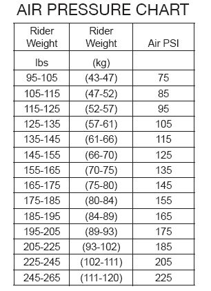
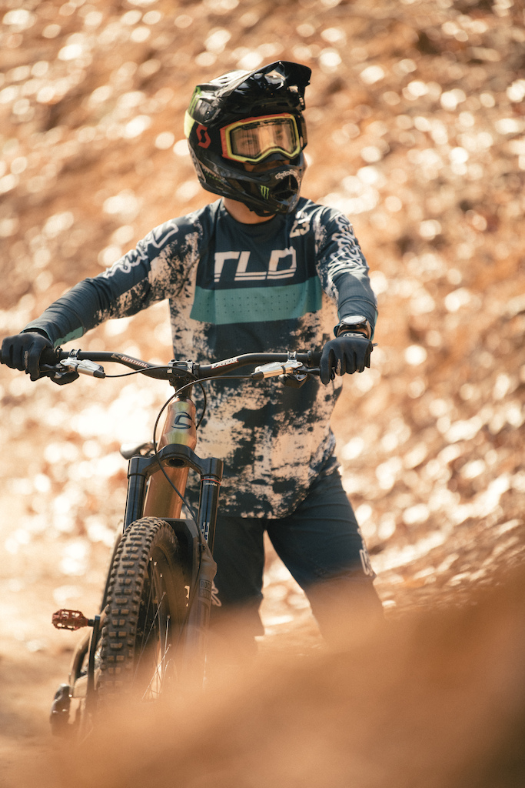
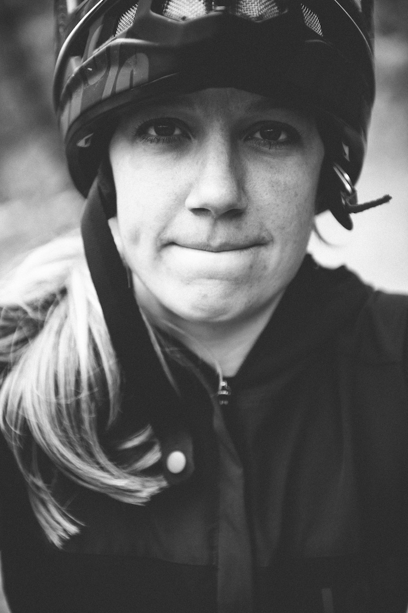

# **Intro to the Bike Guide**
The goal of this page is to explain the parts, frame geometry, and best uses for the Jekyll Carbon 29 2 trail bike. 

## Table of Contents
1. [Parts](#parts)  
2. [Gemeni Suspension](#gemeni-suspension)  
3. [Sizes](#sizes)  
4. [Intended Terrain](#intended-terrain)  
5. [How to Order](#how-to-order)  
6. [Sponsored Riders](#sponsored-riders)
7. [FAQ](#faq)
8. [How to Contribute](#how-to-contribute)
9. [Licensing](#licensing)

  

  
### Parts
* BallisTec Carbon front triangle
* SmartForm C1 Alloy swingarm
* Fox Float Performance 36 Fork 
* Fox Float Factory DPX2 EVOL Gemini shock
* SRAM X01/GX Eagle 12-speed drivetrain
* SRAM Code R hydro disc brakes
* Stan's NoTubes Flow MK3 rims
* Maxxis Assegai tires (front / rear)
  
### Gemeni Suspension
The Gemeni rear shock allows riders to switch between "hustle" and "flow" modes. Hustle is 120mm of travel. Flow is 150mm. 
  
### Sizes
The Jekyll is available in 4 sizes:
  * Small
  * Medium
  * Large
  * XLarge
   
### Intended Terrain
Trail bikes have between 120 and 150mm of suspension travel. Intended terrain could be anything from local XC trails to a lift-assisted bike park. The Jekyll is capable of most green to double black diamond trails.  
* Roots
* Rock gardens
* Rock rolls
* Gap jumps
* Drops
* etc. 
    
### How to Order
>**Step 1:** Go to [Cannondale's website](https://www.cannondale.com/en-it/bikes/mountain/trail-bikes/jekyll/jekyll-carbon-29-2?sku=c21200m10sm)
  
>**Step 2:** Click "Check Retailers" and type your address
  
>**Step 3:** Call your local Cannondale dealer to discuss availability
  
### How to Use
1. Suspension PSI
     * Before useing the Jekyll a rider should make sure front and rear suspension meets has the proper PSI (pounds per square inch) for their weight. 
     * See Fox Air Pressure Chart below.
    

2. Seat Height  
     * When suspension is set up properly the rider should adjust seat height. 
     * Seat height is based on the rider's leg being fully extended when pedaling. 
3. Brakes
     * Pull both brakes and try to push the bike around. If it seems stable then you are ready to ride! 
     * If not, go to your local bike shop from [Step 3](#how-to-order) of *How to Order* and find one. 
 

### Sponsored Riders
 
>[Mitch Ropelato](https://www.monsterenergy.com/sports/mountain-biking/mitch-ropelato) 
  
  

>[Kera Linn](https://www.pinkbike.com/news/getting-to-know-cannondales-new-enduro-rider-kera-linn.html?trk=rss)

### FAQ
How's the ride?  
* With 29in wheels and 150mm the Cannondale Jekyll 29 2 will roll over about any obsatcle. So on the mountain this bike's ride is fantastic but about anywhere else it would be less than ideal. 

Where can I find trails?  
* Download TrailForks on IOS or Android to be shown a map of local trails anywhere in the US or Canada.

What equipment do I need to safely ride?  
* Most mountain bike trails only require a helmet, MIPS is recommended. At lift-assited bike parks riders should wear a full face helment and pads. 

### How to Contribute
This page is open source. Commit changes as necessary.
  
### Licensing
MIT License  
  
_______________________________________________
For questions email <prewittsr@appstate.edu>
or visit [Cannondale's website](https://www.cannondale.com/en-it/bikes/mountain/trail-bikes/jekyll/jekyll-carbon-29-2?sku=c21200m10sm)
