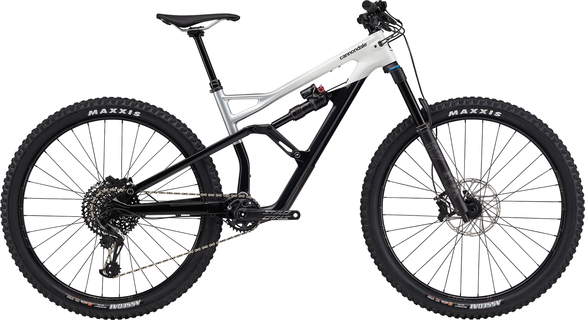

# **Welcome to the Bike Guide**
The goal of this page is to explain the parts, frame geometry, and best uses for the Jekyll Carbon 29 2 trail bike. 

## Table of Contents
1. [Parts](#parts)  
2. [Gemeni Suspension](#gemeni-suspension)  
3. [Sizes](#sizes)  
4. [Intended Terrain](#intended-terrain)  
5. [How to Order](#how-to-order)  
6. [Sponsored Riders](#sponsored-riders)
  

  
### Parts
* BallisTec Carbon front triangle
* SmartForm C1 Alloy swingarm
* Fox Float Performance 36 Fork 
* Fox Float Factory DPX2 EVOL Gemini shock
* SRAM X01/GX Eagle 12-speed drivetrain
* SRAM Code R hydro disc brakes
* Stan's NoTubes Flow MK3 rims
* Maxxis Assegai tires (front / rear)
  
### Gemeni Suspension
The Gemeni rear shock allows riders to switch between "hustle" and "flow" modes. Hustle being 120mm of travel, Flow being 150mm. 

  
  
### Sizes
The Jekyll is available in 4 sizes:
  * Small
  * Medium
  * Large
  * XLarge
  
  
### Intended Terrain
Trail bikes have between 120 and 150mm of suspension travel. Intended terrain could be anyting from local XC trails to the lift-assisted bike park. 
    
### How to Order
>Step 1: Go to [Cannondale's website.](https://www.cannondale.com/en-it/bikes/mountain/trail-bikes/jekyll/jekyll-carbon-29-2?sku=c21200m10sm)
>Step 2: Click "Check Retailers" and type your address.
>Step 3: Call your local Cannondale dealer about buying options.
  
  
### Sponsored Riders
 
Mitch Ropelate & Kera Linn
  
 
 
For questions email: <prewittsr@appstate.edu>
or visit [Cannondale's website](https://www.cannondale.com/en-it/bikes/mountain/trail-bikes/jekyll/jekyll-carbon-29-2?sku=c21200m10sm)
